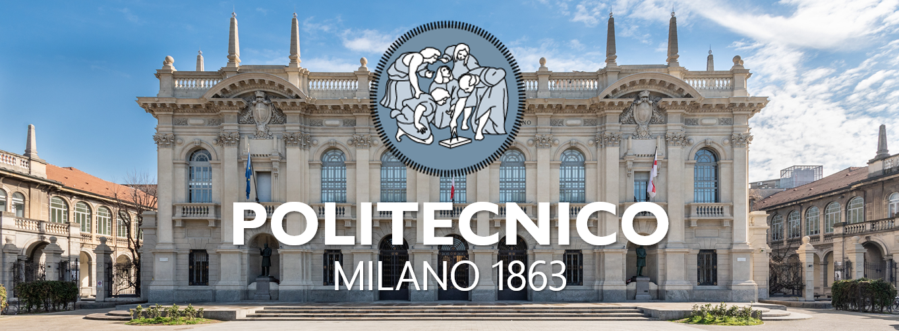

# MSc Mathematical Engineer - Statistical Learning @ **Politecnico di Milano** 

    

Notes from lectures and practical sessions of the courses I have attended during my MSc in Mathematical Engineering - Statistical Learning @ Politecnico di Milano.

## 📚 **Content**
| Course | Professor/s | Academic Year |
|:-------|:------------|:-------------:|
|[Algorithms and Parallel Computing](https://github.com/PaulinoMoskwa/Univeristy-Notes/tree/master/Courses/Algorithms%20and%20Parallel%20Computing)| Danilo Ardagna |2020-2021|
|[Applied Statistics](https://github.com/PaulinoMoskwa/Univeristy-Notes/tree/master/Courses/Applied%20Statistics)| Piercesare Secchi |2019-2020|
|[Artificial Neural Networks and Deep Learning](https://github.com/PaulinoMoskwa/Univeristy-Notes/tree/master/Courses/Artificial%20Neural%20Networks%20and%20Deep%20Learning)| Matteo Matteucci |2020-2021|
|[Bayesian Statistics](https://github.com/PaulinoMoskwa/Univeristy-Notes/tree/master/Courses/Bayesian%20Statistics)| Alessandra Guglielmi |2020-2021|
|[Computational Statistics](https://github.com/PaulinoMoskwa/Univeristy-Notes/tree/master/Courses/Computational%20Statistics)| Andrea Manzoni |2021-2022| 
|[Data Mining and Text Mining](https://github.com/PaulinoMoskwa/Univeristy-Notes/tree/master/Courses/Data%20Mining%20and%20Text%20Mining)| Pierluca Lanzi |2020-2021| 
|[Machine Learning](https://github.com/PaulinoMoskwa/Univeristy-Notes/tree/master/Courses/Machine%20Learning)| Daniele Loiacono |2020-2021|
|[Model Identification and Data Analysis](https://github.com/PaulinoMoskwa/Univeristy-Notes/tree/master/Courses/Model%20Identification%20and%20Data%20Analysis)| Sergio Bittanti, Sergio Savaresi |2019-2020| 
|[Nonparametric Statistics](https://github.com/PaulinoMoskwa/Univeristy-Notes/tree/master/Courses/Nonparametric%20Statistics)| Francesca Ieva, Simone Vantini |2020-2021|
|[Optimization](https://github.com/PaulinoMoskwa/Univeristy-Notes/tree/master/Courses/Optimization)| Edoardo Amaldi |2019-2020| 
|[Real and Functional Analysis](https://github.com/PaulinoMoskwa/Univeristy-Notes/tree/master/Courses/Real%20and%20Functional%20Analysis)| Fabio Punzo |2021-2022|
|[Reliability Engineering and Quantitative Risk Analysis](https://github.com/PaulinoMoskwa/Univeristy-Notes/tree/master/Courses/Reliability%20Engineering%20and%20Quantitative%20Risk%20Analysis)| Enrico Zio |2020-2021|
|[Stochastic Dynamical Models](https://github.com/PaulinoMoskwa/Univeristy-Notes/tree/master/Courses/Stochastic%20Dynamical%20Models)| Franco Fagnola |2019-2020|